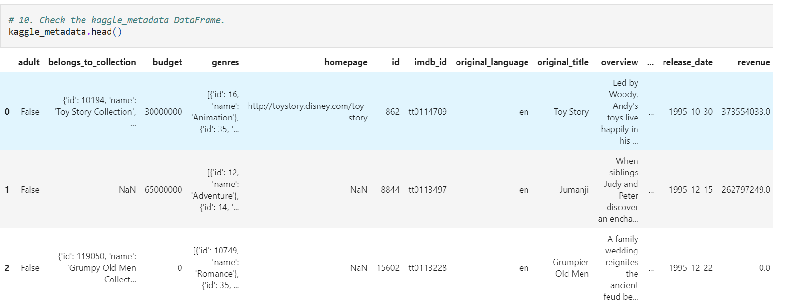
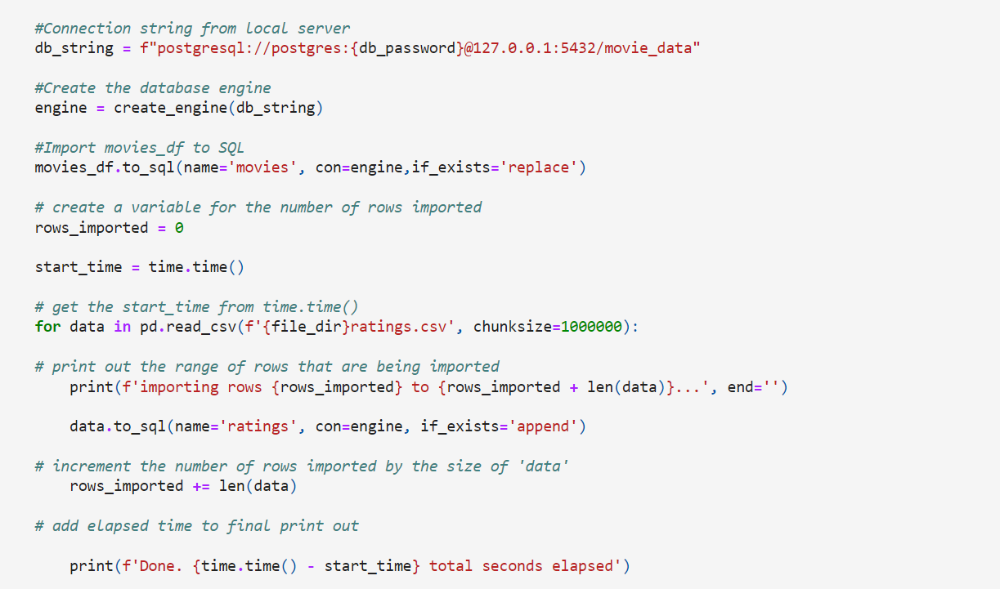

# Movies-ETL

## Overview and Purpose

This project has been undertaken on behalf of Amazing Prime Video, which is a platform for streaming movies and TV shows. An automated pipeline had to be created that would take in movie data from Wikipedia, Kaggle metadata and MovieLens ratings, transform the raw data into a clean dataset, join them and finally load the clean data on PostgreSQL for a fictional hackathon.
The Extract, Transform, Load (ETL) process has been divided into 4 parts-

#### Deliverable 1 : ETL_function_test
- Data is extracted from Wikipedia in JSON format and converted into Pandas DataFrame.
- Data is extracted from Kaggle Metadata and MovieLens CSV files into Pandas DataFrame.

#### Deliverable 2: ETL_clean_wiki_movies
- The TV shows are filtered out from the Wikipedia data and transformed into a Dataframe.
- A try-except block used to catch errors while extracting IMDB IDs with a regular expression.
- A list comprehension is used to keep columns with non-null values.
- The non-null box office data is converted to string values using the lambda and join functions.
- Transformation of the Wikipedia data by cleaning the box office, budget, release date and running time columns.

#### Deliverable 3: ETL_clean_kaggle_data
- Cleaned the Kaggle metadata.
- The Wikipedia and Kaggle dataframes were merged and cleaned.
- Extracted and cleaned the MovieLens Ratings Data.
- Finally merged the ratings data with the Wikipedia and Kaggle metadata.

#### Deliverable 4: ETL_create_database
- Uploaded the clean and merged data on PostgreSQL.
- Existing data in Movies table replaced by current data in PostgreSQL.

## Software Used
- Python
- PostgreSQL

